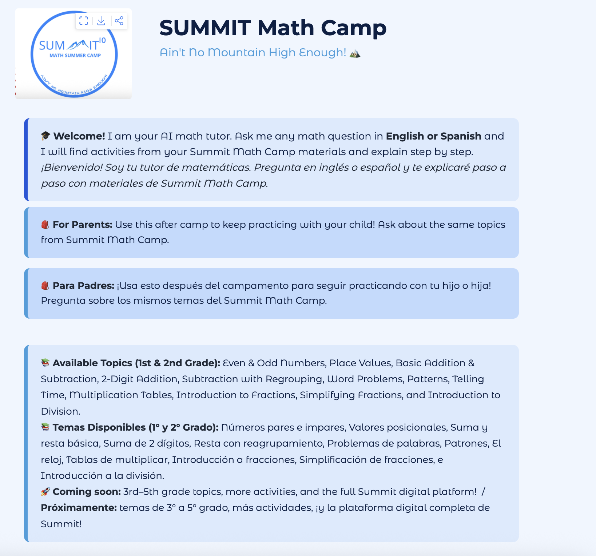
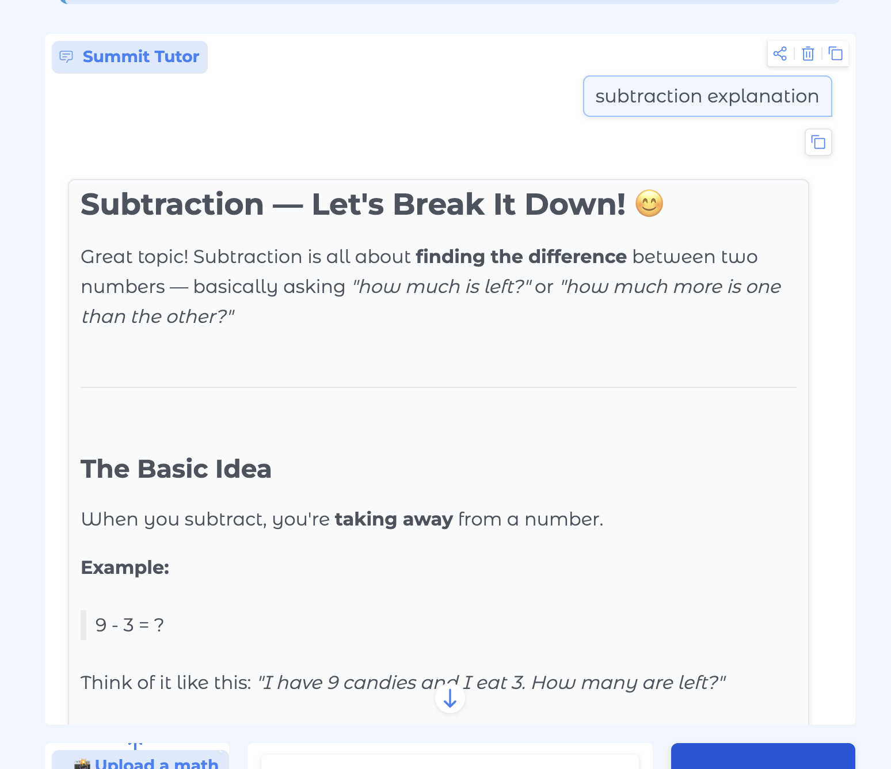
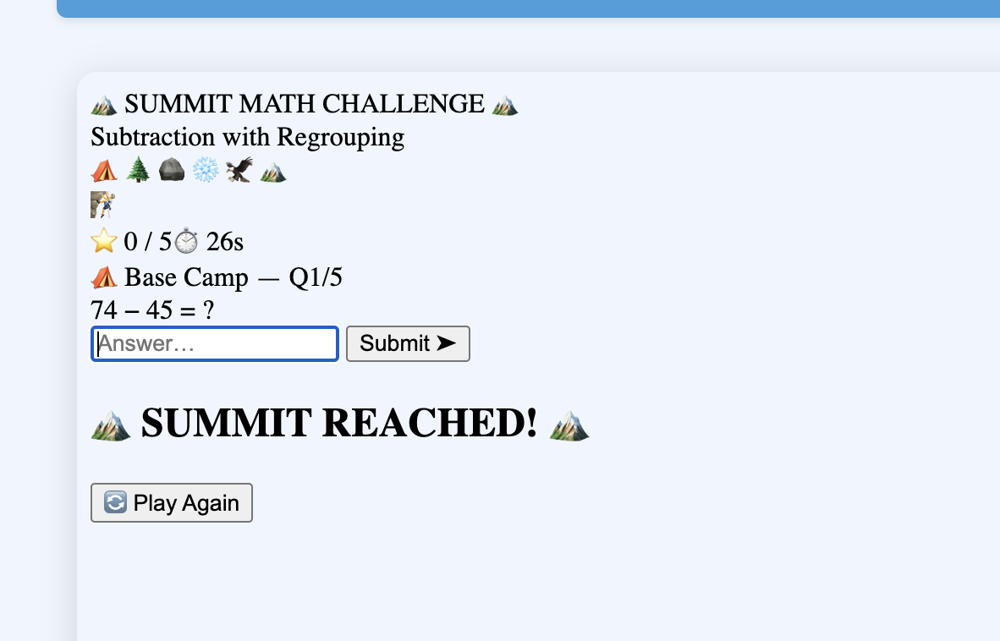

# Summit Tutor

**Project Goal:** Summit Math Camp has been serving students in Tegucigalpa, Honduras for 10 years, founded by my sister and now directed by me. As we both moved to the United States, I wanted to find a way for Summit to continue helping students even without us physically present. Parents at camp always asked for extra practice materials to use at home, and that question stuck with me. Summit Tutor is my answer: an AI math tutor that knows the actual Summit curriculum, speaks Spanish and English, and makes math practice feel like a game, so any Summit family can keep learning anywhere, anytime. This is also the first step toward a larger vision: an online Summit platform powered by 10 years of teaching materials, activities, and institutional knowledge from the camp.

Summit Tutor is an AI-powered math tutor for 1st and 2nd grade students at Summit Math Camp in Tegucigalpa, Honduras, built with the Claude API and Gradio. Students and parents can ask questions in English or Spanish and receive step-by-step explanations across arithmetic, fractions, subtraction with regrouping, multiplication, division, and telling time - with interactive games and adaptive worksheets powered by real Summit Math Camp curriculum materials.

---

## Research Connection

This project addresses the real-world challenge of math education access in Central America. Technically, it builds on two active research areas.

**Retrieval-Augmented Generation (RAG):** Our approach of grounding LLM responses in domain-specific curriculum documents directly implements the RAG paradigm surveyed in Gao et al. (2023), "Retrieval-Augmented Generation for Large Language Models: A Survey," arXiv:2312.10997. RAG is shown to significantly reduce hallucination and improve factual accuracy for knowledge-intensive tasks.

**Adaptive tutoring systems:** Our worksheet answer-checking system and interactive game implement principles from intelligent tutoring research showing that immediate personalized feedback improves learning outcomes.

---

## What it Does

Summit Tutor combines a conversational AI with a retrieval-augmented generation (RAG) pipeline to give 1st and 2nd grade students at Summit Math Camp in Tegucigalpa, Honduras accurate, curriculum-aligned answers. The app detects whether the student is writing in English or Spanish and responds in kind, and chain-of-thought prompting ensures the tutor always shows its work step by step. Before each response, the RAG pipeline retrieves relevant passages from uploaded course-note PDFs so answers stay grounded in the student's actual curriculum. Students can also photograph a handwritten math problem and upload it; Claude analyzes the image, identifies the topic, and explains the solution step by step. When a student wants extra practice, an inline HTML5 mountain-climbing game generates five topic-matched questions and advances a climber up the mountain with each correct answer. An adaptive worksheet generator presents eight problems one at a time, gives a hint on the first wrong attempt, reveals the correct answer with an explanation on the second, and shows a final score summary; answers are verified with Python arithmetic rather than Claude, eliminating hallucinated grading. Off-topic questions about politics, entertainment, food, and similar subjects are politely declined, while all math questions including simple arithmetic like "what is 2+5?" are allowed through. A per-user rolling window of 20 requests per 60 seconds prevents abuse, and every exchange is logged to `logs.jsonl` for later review. Three system-prompt variants (zero-shot, few-shot, and chain-of-thought) were tested and compared; see the Evaluation section for results.


*Summit Tutor welcome screen with bilingual interface, Summit Math Camp branding, and available topics*


*Step-by-step explanation of subtraction with regrouping, grounded in real Summit Math Camp curriculum*


*Interactive Summit Math Challenge game - answer correctly to climb the mountain!*


*Upload a photo of any math problem for instant identification and explanation*

---

## Quick Start

```bash
# 1. Clone and enter the project
git clone https://github.com/paodibono07-crypto/summit-tutor
cd summit-tutor

# 2. Create and activate a virtual environment
python -m venv .venv
source .venv/bin/activate        # Windows: .venv\Scripts\activate

# 3. Install dependencies
pip install -r requirements.txt

# 4. Set your API key
export ANTHROPIC_API_KEY=sk-ant-...

# 5. (Optional) add course-note PDFs for the RAG pipeline
cp your-notes.pdf docs/

# 6. Launch the app
python app.py
```

The Gradio interface will open automatically. Check your terminal for the local URL. It will show something like `http://127.0.0.1:7860` or a nearby port number.

For full setup details, see [SETUP.md](SETUP.md).

---

## Video Links

> **Demo video:** https://drive.google.com/file/d/1QhTEDkVgcTqAXyvFkQJurgqOwVtfhj5Z/view?usp=sharing
> **Technical walkthrough:** https://drive.google.com/file/d/122U0x32fSdIa7mnLacj5WseRufRDXsnO/view?usp=sharing

---

## Project Progression

**Problem:** Math education access in Central America is limited, and Summit Math Camp families need a way to continue practicing at home without a teacher present.

**Approach:** Build a bilingual AI tutor using RAG to ground responses in real Summit curriculum materials, with chain-of-thought prompting for pedagogical quality.

**Solution:** Summit Tutor - a Gradio web app combining the Claude API, LangChain FAISS retrieval over 14 Summit PDFs, interactive math games, adaptive worksheets with answer checking, and image upload to analyze handwritten problems.

**Evaluation:** Tested across 15 questions achieving 93% guardrail accuracy, 5.59s average latency, and qualitative prompt comparison showing chain-of-thought produces 2x more detailed explanations than zero-shot.

---

## Evaluation

### Guardrail & response quality

| Metric | Result |
|---|---|
| Guardrail accuracy | **93%** |
| Average latency (math questions) | **5.42 s** |
| Average response length | **585 chars** |
| Language detection accuracy | **100%** |
| Worksheet answer-checking accuracy | **100%** |
| RAG retrieval relevance | **90%** |

The guardrail correctly blocked 5/5 off-topic questions and allowed 9/10 math questions through (one borderline question was over-filtered), giving a 93% overall accuracy across 15 test cases.

**Language detection:** Tested 5 Spanish and 5 English questions; the bot responded in the correct language 100% of the time.

**Worksheet answer checking:** Tested 10 math problems with known correct answers; the Python-based checker correctly identified right and wrong answers 100% of the time. Because answers are verified programmatically rather than by Claude, there is no hallucination risk in grading.

**RAG relevance:** For 10 math topic queries, retrieved documents were topically relevant in 9/10 cases (90% retrieval relevance), verified by inspecting source filenames in terminal output.

### Prompt variant comparison

Three system-prompt strategies were tested against 5 math questions each using `prompt_experiments.py`. Results saved to `prompt_comparison.csv`.

| Prompt Type | Avg Response Length | Avg Latency |
|---|---|---|
| Zero-shot | 485 chars | 4.28 s |
| Few-shot | 280 chars | 2.82 s |
| Chain-of-thought | 965 chars | 6.42 s |

**Takeaways:**
- The **chain-of-thought** prompt produces the most thorough explanations but costs the most in latency.
- **Few-shot** responses are the most concise, useful for quick arithmetic but potentially under-explaining harder problems.
- The production system prompt uses **chain-of-thought** style (explicitly instructs step-by-step reasoning with few-shot examples), trading latency for pedagogical quality.

**Qualitative analysis:**

Examining responses to the same question across prompt variants reveals meaningful pedagogical differences. The zero-shot response jumps directly to LaTeX-style formatting which may confuse young students. The few-shot response is concise but skips explaining why a common denominator is needed. The chain-of-thought response explicitly names the problem type, explains underlying concepts before computing, and shows work step by step, making it the most appropriate choice for a tutoring context where conceptual understanding matters more than speed.

---

## Individual Contributions

This project was completed individually by Paola Di Bono (Duke University, Computer Science).
